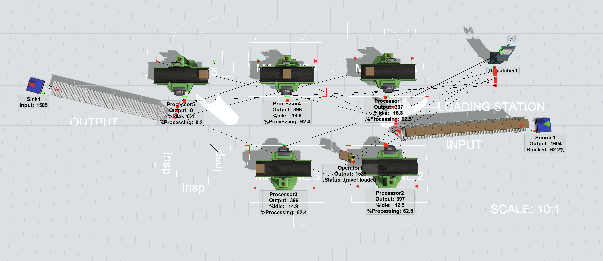
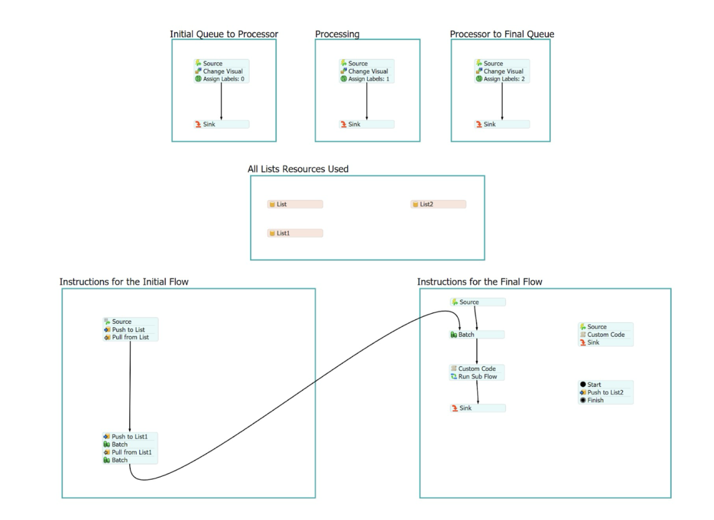
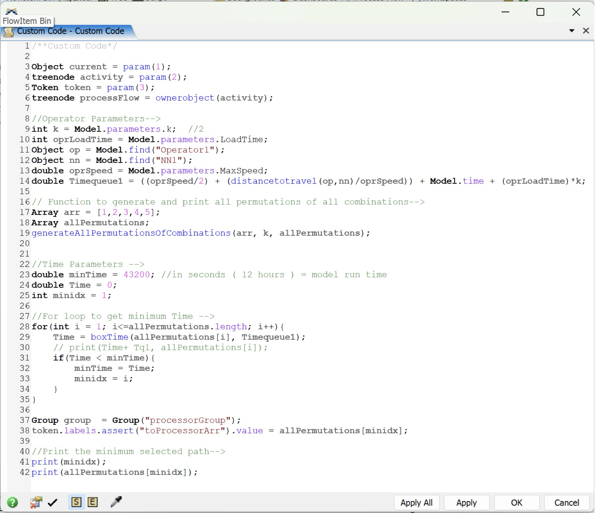
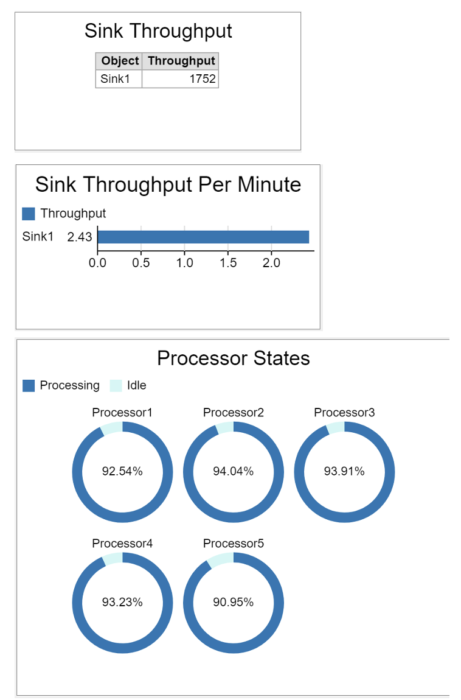

# Piston Factory Digital Twin: Predictive Modeling & Optimization

This repository contains a **Simulation-based Digital Twin** developed to simulate and optimize a piston manufacturing assembly cell. By leveraging **Discrete Event Simulation (DES)** and custom **FlexScript (C-based)** logic, this project identifies operational bottlenecks and prescribes optimized workflows to maximize system efficiency.

*A 3D visualization of the piston assembly cell, featuring 5 processing machines, a source/sink, and operator waypoints.*

## 🚀 Strategic Impact
Through iterative **A/B testing** and algorithmic pathfinding, the model achieved the following performance benchmarks:
* **Throughput Maximization:** Increased total output from **886 to 1,752 units** per 12-hour cycle.
* **Resource Optimization:** Boosted average machine utilization to **~93%** (up from baseline averages of ~35%), effectively eliminating idle-time waste.
* **Latency Reduction:** Implemented a **custom routing heuristic** that reduced operator travel time and minimized "waiting for transporter" states.

## ⚙️ System Parameters & Constraints
The simulation was grounded in the following physical and operational constraints:
* **Infrastructure:** 5 Processing Machines, 1 Loading Station, Input/Output Conveyors.
* **Process Time:** 68 seconds per piston.
* **Operator Specs:** Capacity of 2 units, max walking speed of 1.33 m/s, loading time of 6s, unloading time of 4s.

## 🧠 Optimization Strategy
The default factory logic resulted in severe bottlenecks, with machines sitting idle for up to 50% of the production cycle due to inefficient operator routing. I approached this problem in three phases:

### 1. Process Flow & State Management
Replaced the default model logic with customized "Process Flows." This established strict logical conditions for the operator, forcing them to prioritize tasks efficiently (e.g., retrieving finished goods before fetching raw materials). 

*Global lists and process flows were used to dynamically assign tasks based on machine availability.*

### 2. Algorithmic Pathfinding (FlexScript)
To eliminate wasted travel time, I wrote custom C-based **FlexScript**. The script generates all possible permutations of operator travel paths between available machines, calculating the mathematical minimum distance before executing the routing command.

*Snippet of the custom routing algorithm used to calculate the shortest path dynamically.*

### 3. Resource Scaling
After optimizing the programmatic logic, I scaled the workforce parameter from 1 operator to 2, dividing the tasks symmetrically to ensure continuous machine feeding and eliminate the final system bottleneck.

## 📊 Results & Business Impact
Through iterative A/B testing, the combination of the custom shortest-path algorithm and the 2-operator process flow yielded massive system improvements:

* **Throughput Increase:** Total output over a 12-hour shift scaled from 886 units (baseline) to **1,752 units**, a **97.7% increase**.
* **Resource Utilization:** Average machine capacity utilization skyrocketed from ~35% to **~93%**, effectively eliminating the system bottleneck.

*Final simulation dashboard showing sustained >90% processing states across all 5 machines.*

## 📁 Repository Structure

    Piston-Factory-Digital-Twin-Optimization/
    │
    ├── models/
    │   ├── Baseline_1_Operator.fsm            
    │   ├── Optimized_ProcessFlow.fsm          
    │   ├── CustomCode_ShortestPath.fsm        
    │   └── Final_2_Operators.fsm              
    │
    ├── docs/
    │   ├── Final_Project_Report.pdf           
    │   ├── Dashboards_and_KPIs.pdf            
    │   ├── Factory_Layout.dwg                 
    │   └── Flexsim_Internship_Certificate.pdf 
    │
    ├── data/
    │   └── Input_Data.xlsx                    
    │
    └── images/
        ├── factory_3d_layout.png              
        ├── custom_code_snippet.png            
        ├── dashboard_results.png              
        └── process_flow_logic.png             

## 🛠️ How to Run
1. Clone this repository.
2. Ensure you have **FlexSim 2024** (or newer) installed.
3. Open `models/Final_2_Operators.fsm` in the FlexSim environment.
4. Reset and Run the model to view the optimized simulation and live dashboard statistics.